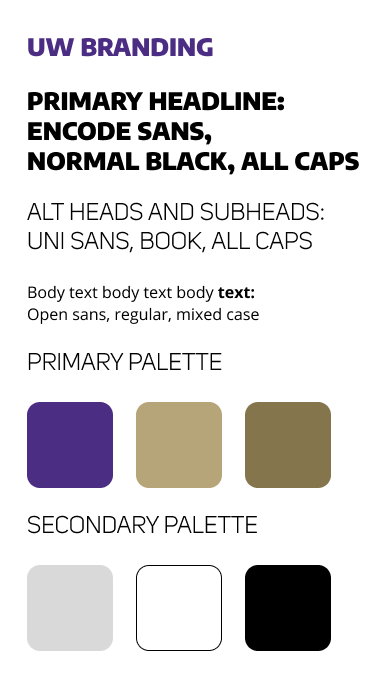
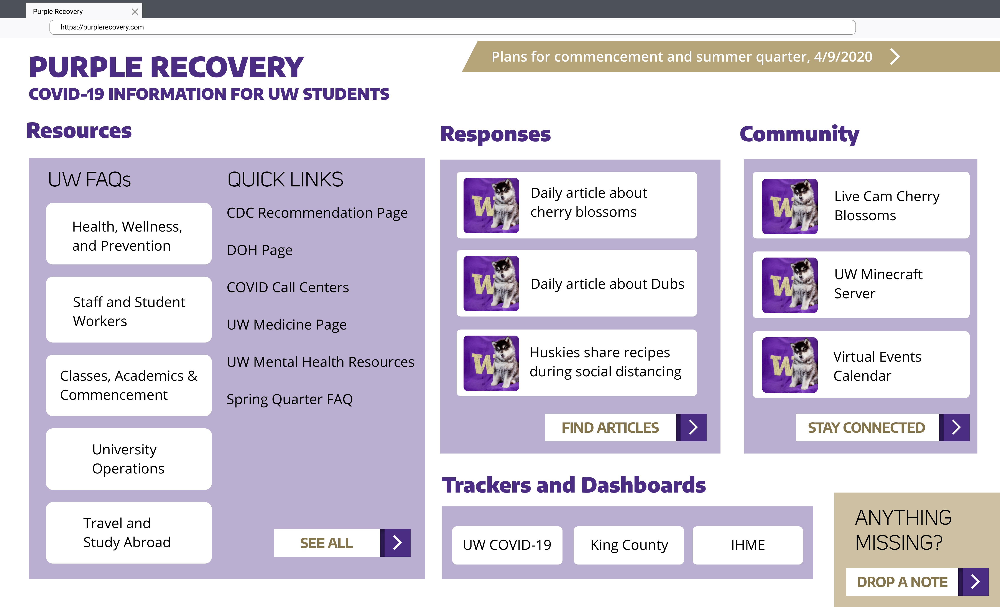
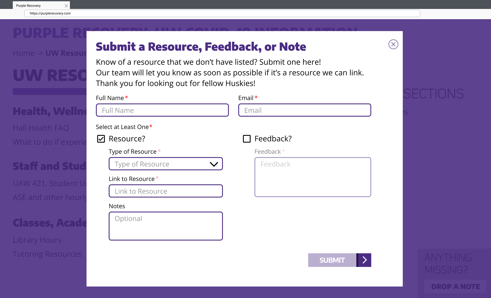
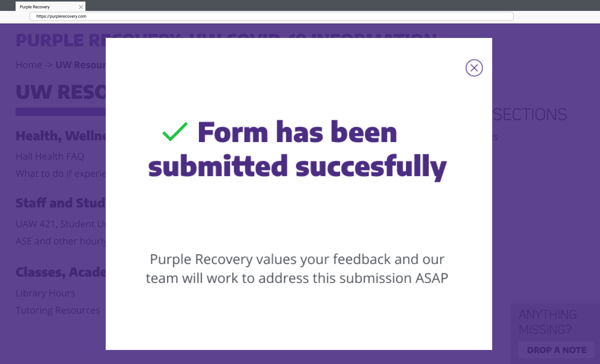
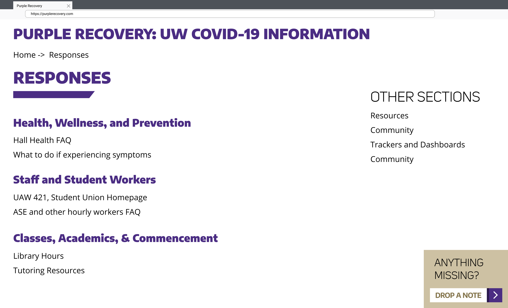

#Homework 3: Requirements 

**Purple Recovery**
------

* A note: photos are mainly for reference, and are not hard requirements. Our requirements are number-indexed. 

## Glossary
* __Breadcrumb Link__: a type of secondary navigation scheme that reveals the user's location in the website relative to the Main Dashboard page.
* __Card Button__: An html card component that acts as a button to link to an external site.
* __Sticky__: fixed position on screen and always visible regardless of the user’s current scrolling position.
* __"Added to Purple Recovery"__: Each of the main sections ("Resources", "Responses", "Community", and "Trackers & Dashboards") will have a stored set of links. How they will be stored can be decided by engineers. There are two ways they are added: 
	* Team-Curated: Identified as a resource/link appropriate to be added to Purple Recovery section (e.g., we might identify the UW Minecraft server as a "Community" resource/link. Adding it will add it to the Community links.)
	* User-submitted/via Drop-A-Note feature (defined in more detail in section below): Users or visitors of Purple Recovery are able to submit resources that they deem might be appropriate for any of our sections. The Purple Recovery team will then have a vetting process in determining if this link would be good to be added. If it is, it will be added to the same stored set of links for the specific section. 

## Target Screen Size
`revised` * This web app will be built for screen sizes 1400 pixels wide as the ideal view size.
> Rationale: This was a very arbitrary requirement to begin with; we updated the screen size as it was our most common development environment/i.e. easiest to work with for our developers.

## 1: Main Dashboard
`complete` 1.1. This web app will be made with HTML, CSS, JavaScript, and React.

`complete` 1.2.The web app will be accessible via Google Chrome, Firefox, and Internet Explorer.

`complete` 1.3 The colors and typography used for the web app will adhere to the UW Branding Guide.

 _Image of University of Washington Branding Guide for reference_
 

`complete` 1.4. The web app will be divided into these 5 sections: Resources, Responses, Community, Trackers & Dashboards, and Drop a Note. 

`complete` 1.5. Each section will be displayed as a box with content on the main page. 

_Image of Main Dashboard view as a wireframe_

`complete` 1.6. Every section (excluding Trackers & Dashboards and Drop a Note) has a button to open a section’s additional information on a new page. The individual button in each of the sections will contain the respective text (phrase after the dash): 

* Resources Section - See All
* Responses - Find Articles
* Community - Stay Connected

`complete` 1.7. On the top left of each page, the dashboard header will contain “Purple Recovery” as a title header, and “COVID-19 Information for UW Students” as a subheader. Clicking the title and/or subheader will bring the user back to the main dashboard page. 

`complete` 1.8. On the top right of the landing page, there will be a banner displaying the title and date posted of the newest message or update posted in the Messages & Updates section found in the [Official UW COVID-19 Page](https://www.washington.edu/coronavirus/). Clicking this will link to the corresponding message or update link.

##2: Resources

`complete` 2.1. The Resources section will be divided into two subsections as columns. 

`complete` 2.2. The left column will be titled “UW FAQs” and the right column titled “Quick Links”. 

`complete` 2.3. The “UW FAQs” column will contain 5 sub-sections in rows. Each will be a card buttons with the following titles: “Health, Wellness, and Prevention”, “Staff and Student Workers”, “Classes, Academics & Commencement”, “University Operations”, and “Travel and Study Abroad”

`complete` 2.4. Clicking any one of the 5 card buttons will redirect the user to the corresponding section on the official UW FAQ Page. 

`revised` 2.5. The sub-section hyperlinks will follow this format: https://www.washington.edu/coronavirus/#[subsection name]
Where [subsection name] will be replaced with the following respective names: ‘health’, ‘staff’, ‘classes’, ‘operations’, and ‘travel’.
> Rationale: This is not accurate anymore as UW COVID-19 page has made changes from their end. Purple Recovery currently reflects the 5 sections, but the hyperlinks are now different. We realize this shouldn't even have made it onto our requirements file, as hyperlinks are very dynamic.  

`complete` 2.6. The “Quick Links” section, which is the right column underneath the Resources section, will display 6 individual hyperlinks found on the UW COVID-19 page: “CDC recommendation page”, “DOH page”, “COVID Call Center”, “UW Medicine page”, “UW Mental Health Resources”, and “Spring Quarter FAQ”. These will be displayed in a list view of text hyperlinks, and clicking any of them will redirect the user to that resource’s external website.

##3: Responses

`complete` 3.1. This section will contain links to UW-community published material (The Daily, UW Faculty Messages, UW Facebook Pages, etc.). 

`complete` 3.2. The articles will be displayed as card buttons with the article title on the right and the page cover image in the article on the left (if available). 

`complete` 3.3. The Responses section will display 3 of the most recently added articles to Purple Recovery on the main dashboard page.

`complete` 3.4. The section will display a ‘Find Articles’ button in the bottom right corner that links to the Responses’ section view page.

##4: Community

`complete` 4.1. This section will contain the three most recently added Community links to Purple Recovery. These links can either be team-curated (added by Purple Recovery team) or added by the public via "Drop A Note" (and then verified by Purple Recovery team). 

`complete` 4.2. Each link will be displayed as a card button with the Community resource title on the right and a related icon on the left. 

`complete` 4.3. The section will display a ‘Stay Connected’ button in the bottom right corner that links to the Community’s section view page.

##5: Trackers & Dashboards

`complete` 5.1 This section will contain links to data visualization dashboards regarding COVID-19 statistics. 

`complete` 5.2. The links in this section will be displayed as card buttons with the Tracker/Dashboard name on the main dashboard page. 

`complete` 5.3. There will be three card buttons:

`complete` * 5.3.1. The first card buttons will be titled “UW COVID-19” and will link to the UW COVID-19 Testing Results page (https://www.washington.edu/coronavirus/testing-results/) .

`complete`* 5.3.2. The second card button will be titled “King County” and will link to the King County COVID-19 data dashboard (https://www.kingcounty.gov/depts/health/communicable-diseases/disease-control/novel-coronavirus/data-dashboard.aspx)

`complete` * 5.3.3. The third card button will be titled “Washington State” and will link to the Washington Department of Health (DOH) COVID-19 page (https://www.doh.wa.gov/emergencies/coronavirus)
> Notes on 5.3.1 - 5.3.3: Titles and links have been updated to be more informative. Third tracker/dashboard is now IHME, as we figured they are also a credible source.

##6: Drop a Note

_Image of Drop a Note form as a wireframe_

`complete` 6.1. On the bottom right of each page, there will be a sticky square section, containing, “Anything missing?” and a button that contains the text “Drop a Note”. 

`complete` 6.2. When clicked, the “Drop a Note” button will overlay a modal form on top of the user’s current page position. 

`complete` 6.3. The form created from clicking “Drop a Note” will contain a card title, description, input fields, and a “Submit” button. 

`complete` 6.4. On the top right corner, the form will have a button with an “x” icon; clicking it closes the form.

`complete` 6.5. The user will be able to click either the “Feedback?” and “Resource?” radio buttons

`complete` 6.6. The user will be able to input string values in the “First Name”, "Last Name", and “Email” fields.

`complete` 6.7. The “Type of Resource” dropdown will consist of the following options: Resources, Responses, Community, Trackers and Dashboards, and Other.

`complete` 6.8. If the “Resource” radio button is selected, the user will be able to input string values in the “Link to Resource” and “Notes” fields and use the “Type of Resource” dropdown to choose a resource type to submit altogether. 

`complete` 6.9. If the “Feedback” radio button is selected, the user will be able to input string values in the “Feedback”  field.

`complete` 6.10. The “Submit” button will push the entered data through an internal verification process.

`complete` 6.11. The verification process is done through React Hook and will ensure that categories that are checked should have all fields filled in and that formatting for email is syntactically correct (i.e. example@hostsite.com).

`complete` 6.12. The verification process will also validate submitted links in React.

`complete` 6.13. If the submission is found to be incomplete by this verification process, the user will be prompted to edit the fields highlighted that did not pass the verification process and submit again.

`complete` 6.14. If the submission is complete and without error, a successful submission message will appear in place of the previous screen’s view.

`complete` 6.15. On the top right corner, the successful submission message will have a button with an "x" icon; clicking it closes the sucessful submission message modal screen. 

_Image of successful Drop a Note form submission as a wireframe_

##7: Section View Page

_Image of Response Section View Page as a wireframe_

`complete` 7.1. A section view page will be made for the following three sections: Resources, Responses, and Community.

`complete` 7.2. The section view page will contain a breadcrumb link in the top left below the site title.

`revised, see note` 7.3. Each of the breadcrumbs will link to the respective internal page that is displayed in the list. 
> We decided that the second breadcrumb link should not be a link, as it would just lead the user to the page they are already at (i.e. basically refresh the page). It would lead to redundant user experience that accomplishes no goal.

`complete` 7.4. The section view page will contain a title of the section that it is related to.

`complete` 7.5. The section view page will display a more comprehensive list of relevant links to its parent section from the main dashboard, as an overflow for the main page.

`revised` 7.6. All urls will be populated by developers inside of the HTML file.
> Rationale: Currently our links are in .js files; We realize that this is an implementation detail, and shouldn't have been a requirement to begin with.

`revised` 7.7. The list of relevant links will also contain a descriptive label or sentence about the links that are listed.
> Rationale: We've decided against this, as Purple Recovery is mainly a vessel for information. We are not going to be editorializing anything, we are simply serving as an information consolidation tool.

`complete` 7.8. The “Drop a Note” feature will stay sticky in the bottom right of the page view--the same location as the main dashboard.

`complete` 7.9. The section view page will contain a text navigation of all of the resources’ section view pages on the right hand side under the heading “Sections”. The current page that the user is on will be a deadlink/disabled link. 
> Instead of this, we now just have a standard text nav. More intuitive for users than a changing nav would be. 

------
